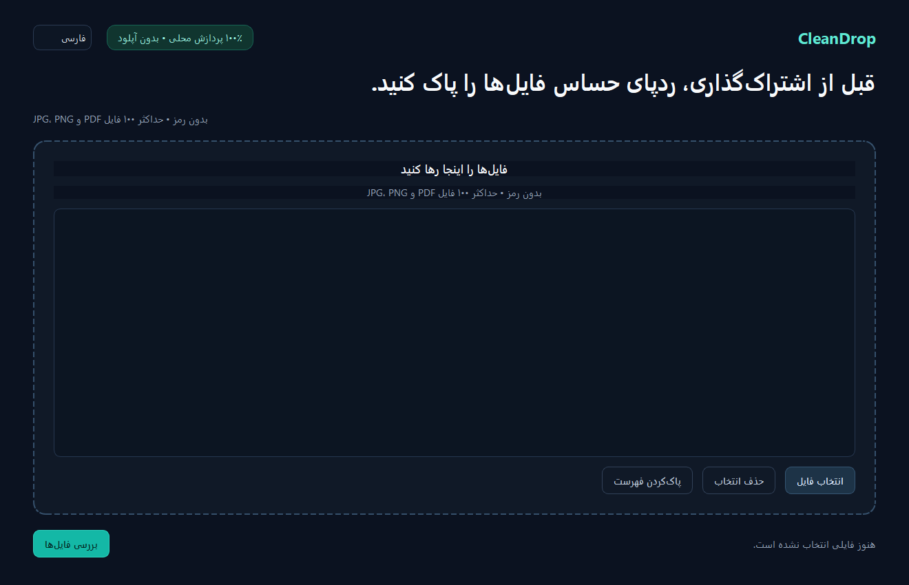

# CleanDrop

> فایل را پیش از اشتراک‌گذاری، کاملاً روی دستگاه خودتان پاک‌سازی کنید.

[English](README.md) · [حریم خصوصی](docs/privacy.md) ·
[مدل تهدید](docs/threat-model.md) · [سیاست راستی‌آزمایی](docs/verification-policy.md)



CleanDrop یک برنامه دسکتاپ ویندوز و ابزار خط فرمان برای آماده‌سازی امن‌تر فایل‌های
JPG، JPEG، PNG و PDF بدون رمز است. برنامه متادیتا و برخی اطلاعات حساس را پیدا
می‌کند، امکان مرور و پوشاندن دستی را می‌دهد، فایل تازه‌ای فقط از پیکسل‌ها می‌سازد،
خروجی را دوباره بررسی می‌کند و یک گزارش JSON نسخه‌دار تحویل می‌دهد.

مسیر پردازش همیشه به این ترتیب اجرا می‌شود:

`بررسی ← تشخیص ← مرور ← برنامه پاک‌سازی ← بازسازی ← راستی‌آزمایی ← گزارش`

هیچ خروجی‌ای بدون اجرای مرحله راستی‌آزمایی موفق اعلام نمی‌شود.

## قابلیت‌های اصلی

- پردازش صددرصد محلی؛ بدون آپلود، حساب کاربری، تحلیل رفتار یا API خارجی
- تشخیص نوع واقعی فایل از روی Magic Bytes
- محاسبه SHA-256 ورودی و خروجی
- شناسایی متادیتا، GPS، ایمیل، شماره تلفن، URL، کارت معتبر با Luhn و کد ملی ایران
- OCR فارسی و انگلیسی با Tesseract و تنظیم `fas+eng`
- تشخیص Text Layer در PDF و OCR صفحه‌های اسکن‌شده
- مرور و انتخاب یافته‌ها و رسم مستطیل پوشاننده روی پیش‌نمایش
- بازسازی کامل تصویر از پیکسل‌ها و حذف EXIF/XMP
- Secure Flatten برای PDF با ساخت یک PDF کاملاً جدید و تصویری
- پردازش گروهی تا ۱۰۰ فایل
- رابط فارسی راست‌به‌چپ و انگلیسی
- CLI مستقل و گزارش JSON بدون مقدار خام اطلاعات حساس

## نصب در ویندوز

1. فایل `CleanDrop-Setup-1.0.0.exe` را از
   [آخرین Release](https://github.com/Omidzamani11/CleanDrop/releases/latest)
   دریافت کنید.
2. مقدار SHA-256 آن را با فایل `SHA256SUMS.txt` همان Release مقایسه کنید.
3. Installer را اجرا کنید. نصب برای کاربر فعلی انجام می‌شود و دسترسی Administrator
   لازم ندارد.
4. از Start Menu برنامه **CleanDrop** را باز کنید.

نسخه Portable نیز منتشر می‌شود. ZIP را کامل Extract کنید و `CleanDrop.exe` را
در کنار پوشه `_internal` نگه دارید.

نسخه عمومی نخست امضای دیجیتال Code Signing ندارد؛ بنابراین ممکن است Windows
SmartScreen هشدار «ناشر ناشناس» نشان دهد. پیش از ادامه، آدرس Release و checksum
را بررسی کنید.

## روش استفاده

1. یک یا چند فایل را روی برنامه رها یا از انتخابگر فایل اضافه کنید.
2. منتظر بررسی محلی و OCR بمانید.
3. یافته‌ها را مرور کنید؛ موارد لازم را انتخاب یا لغو کنید و در صورت نیاز روی
   پیش‌نمایش مستطیل دستی بکشید.
4. پوشه خروجی و کیفیت PDF (`150`، `200` یا `300` DPI) را تعیین کنید.
5. نسخه پاک‌شده را بسازید.
6. نتیجه کنترل‌ها و گزارش JSON کنار خروجی را مرور کنید.

فایل اصلی هرگز بازنویسی یا حذف نمی‌شود.

## خط فرمان

Installer فایل `cleandrop-cli.exe` را نیز نصب می‌کند:

```powershell
.\cleandrop-cli.exe doctor
.\cleandrop-cli.exe inspect .\sample.jpg --json
.\cleandrop-cli.exe sanitize .\document.pdf --profile secure-flatten --dpi 200 --output .\document.cleaned.pdf
.\cleandrop-cli.exe verify .\document.cleaned.pdf --policy secure-share --json
.\cleandrop-cli.exe batch .\one.jpg .\two.png --output-dir .\cleaned --json
```

کدهای خروج:

| کد | معنی |
|---:|---|
| `0` | همه کنترل‌های الزامی موفق بوده‌اند |
| `2` | عملیات با هشدار یک کنترل اختیاری یا محدود انجام شده است |
| `10` | ورودی یا درخواست نامعتبر |
| `20` | خطای بررسی یا پردازش |
| `30` | شکست راستی‌آزمایی |
| `40` | لغو عملیات |
| `70` | خطای داخلی پیش‌بینی‌نشده |

## حریم خصوصی و محدودیت امنیتی

CleanDrop هیچ Network Client برای ارسال فایل ندارد و هیچ آپلود، Telemetry،
بررسی آپدیت، ورود یا API ابری انجام نمی‌دهد. Tesseract و ExifTool فقط روی دستگاه
و با `shell=False` اجرا می‌شوند. گزارش عمومی به‌جای متن خام OCR یا PII، پیش‌نمایش
پوشانده‌شده و evidence hash ذخیره می‌کند.

CleanDrop آنتی‌ویروس نیست، Steganography را پیدا نمی‌کند، امنیت صددرصد تضمین
نمی‌کند، ممکن است OCR اشتباه کند، فایل اصلی را پاک نمی‌کند و سیستم‌عامل آلوده را
ایمن نمی‌سازد. پیش از ارسال، حتماً پیش‌نمایش و گزارش را بررسی کنید.

عبارت نتیجه موفق این است:

> طبق سیاست بررسی انتخاب‌شده، اطلاعات حساس شناسایی نشد.

این عبارت به معنی «۱۰۰٪ امن» نیست.

## توسعه و ساخت

برای توسعه Python 3.12 لازم است:

```powershell
py -3.12 -m venv .venv
.\.venv\Scripts\python.exe -m pip install --upgrade pip
.\.venv\Scripts\python.exe -m pip install -e ".[dev]"
.\.venv\Scripts\python.exe -m pytest -q
.\.venv\Scripts\python.exe -m ruff check .
.\.venv\Scripts\python.exe -m ruff format --check .
.\.venv\Scripts\python.exe -m mypy src\cleandrop
```

راهنمای کامل در [docs/development.md](docs/development.md) و معماری در
[docs/architecture.md](docs/architecture.md) است.

## نقشه راه

مسیر نسخه‌های ۱.x در همان مرز محلی و بدون سرویس ابری باقی می‌ماند:

- امضای دیجیتال و بهبود زنجیره انتشار ویندوز؛
- Fixtureها و Fuzzing گسترده‌تر برای PDFهای ناسازگار و خصمانه؛
- بهبود دسترس‌پذیری و کار با صفحه‌کلید؛
- پردازش سریع‌تر Batch بدون کاهش کنترل‌های راستی‌آزمایی؛
- قواعد متادیتای محلی و ترجمه‌های بیشتر.

قابلیت‌های خارج از محدوده، بدون بازنگری رسمی مدل تهدید به محصول اضافه نمی‌شوند.

## مجوز

CleanDrop تحت مجوز
**GNU Affero General Public License v3.0 or later** (`AGPL-3.0-or-later`)
منتشر می‌شود. فایل‌های [LICENSE](LICENSE) و
[THIRD_PARTY_NOTICES.md](THIRD_PARTY_NOTICES.md) را ببینید.
