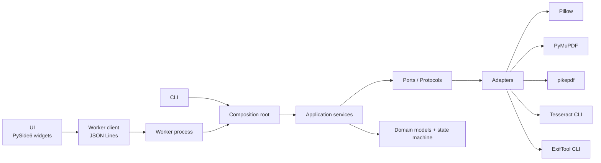
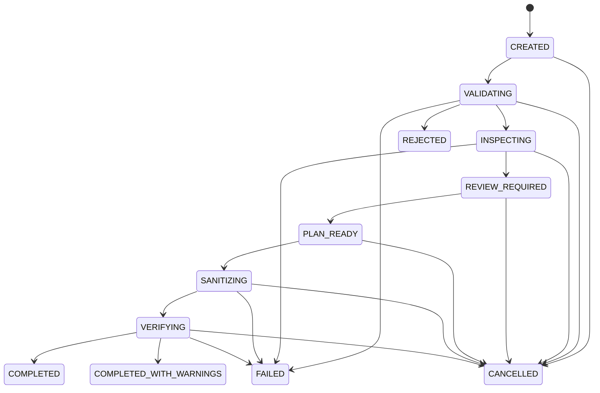

# Architecture

## Goals

CleanDrop is a local-only desktop boundary around untrusted media. The design
separates policy from file libraries, keeps heavy processing outside the UI
thread, and makes successful completion depend on verification.

## Layers



Dependency direction:

- `domain` contains typed values, invariants, and job states. It imports no UI,
  imaging, PDF, or external-tool library.
- `application` defines protocols and orchestration. Concrete adapters are
  injected by `cleandrop.composition`.
- `adapters` implement file sniffing, metadata inspection, OCR, image/PDF
  transformation, verification, and report storage.
- `worker` owns expensive and untrusted-file processing.
- `ui` only prepares requests, renders local previews returned by a worker, and
  displays masked findings and verification checks.
- `cli` composes the same services without the UI.

## Mandatory pipeline



The state machine rejects any path from a non-verification state to a successful
terminal state.

## Worker protocol

The desktop starts the frozen executable with `--worker`; a source checkout uses
`python -m cleandrop.worker.worker_main`. One request is written to stdin and
versioned events are read from stdout as UTF-8 JSON Lines.

Every event contains:

```json
{
  "protocol_version": "1.0",
  "event_type": "progress",
  "job_id": "uuid",
  "timestamp": "ISO-8601 UTC",
  "payload": {}
}
```

Allowed events are `job_started`, `stage_started`, `progress`, `finding`,
`warning`, `error`, `cancelled`, and `completed`. Public event payloads contain
masked values. A full local output path is returned only in an explicitly marked
`private_review` completion payload for the active UI process; it is not written
to the public report.

Cancellation first requests process termination and then forces termination
after two seconds. Temporary paths are prefixed with the worker PID; cleanup
removes only those PID-scoped paths. Final outputs appear only after an adapter
has verified a temporary file and atomically replaced the destination.

## Image transformation

1. Validate path, limits, and magic bytes.
2. Decode and fully load the image.
3. Apply EXIF orientation.
4. Copy pixels into a fresh RGB/RGBA image.
5. Paint selected redaction rectangles.
6. Encode into an isolated temporary directory without source metadata.
7. Reopen with Pillow and inspect with ExifTool.
8. Check dimensions, type, metadata, pixel coverage, and OCR of redaction crops.
9. Atomically rename to a non-colliding output path.

## PDF secure flatten

1. Reject encrypted or malformed input.
2. Inspect metadata, XMP, attachments, annotations, forms, JavaScript, and actions.
3. Extract text-layer blocks and normalized positions; OCR sparse pages.
4. Render each page at `150`, `200`, or `300` DPI.
5. Paint redactions on raster pixels.
6. Create an empty PDF and add only page images.
7. Save to a PID-scoped temporary directory.
8. Reopen with PyMuPDF and pikepdf, checking page count, absent native text,
   active objects, metadata, pixel coverage, and redaction-crop OCR.
9. Atomically rename only when required checks pass.

No source PDF object is copied into the destination.

## Reports

Reports use schema `1.0` with top-level `input`, `inspection`,
`sanitization_plan`, `verification`, `warnings`, and `output` objects. Input
paths and input/output names are hashed; only file extensions remain readable.
Findings store a masked preview, evidence hash, kind, confidence, source, and
normalized box—not raw PII.
