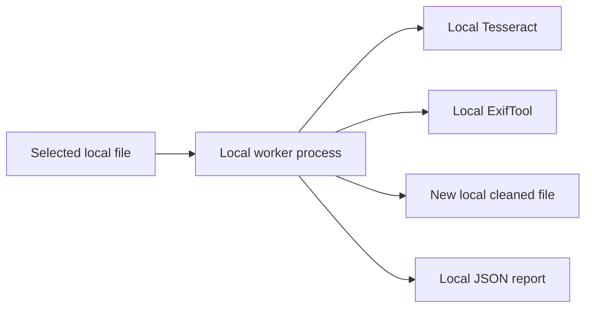

# Privacy

## Plain-language promise

CleanDrop processes selected files on your computer. It does not upload file
content or metadata, create an account, send analytics, check for updates, or
call an AI service.

## Data flow

There is no network destination in the application architecture.

## What is kept

- The original file remains where it was.
- A newly named cleaned file is created in the selected folder.
- A `*.cleandrop.json` report is created beside the cleaned file.
- The report includes input/output SHA-256 values, masked finding descriptions,
  evidence hashes, normalized coordinates, transformations, checks, and warnings.
- The UI language preference is stored through the operating system’s Qt settings.

## What is not kept

- no account profile or database;
- no cloud copy;
- no telemetry, analytics, crash upload, or update request;
- no raw OCR text or raw PII in the public JSON report;
- no full input path or raw input/output filename in the public JSON report;
- no raw external-tool stderr shown to the user.

The active desktop process temporarily knows the selected path so it can open the
file and output folder. Preview images and intermediate files use isolated system
temporary directories and are removed when their owner exits normally; PID-scoped
cleanup handles a terminated worker.

## Network verification

The source contains no HTTP client dependency and no application network call.
Release provisioning and CI use the network to download build dependencies; that
code is under `scripts/` and is not called by the installed application.

## User responsibility

A cleaned file can still visibly contain information the detector did not select.
Review every page and add manual redactions. CleanDrop does not erase the source;
manage or securely delete it separately if required.
